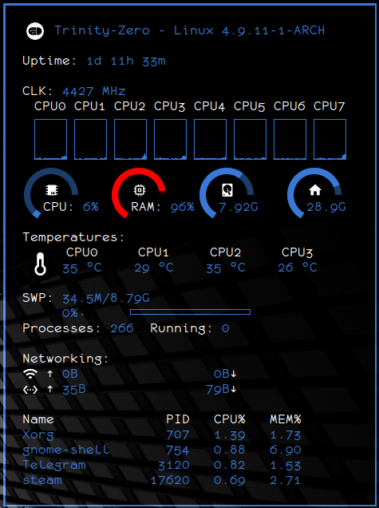

# overconky
My personal conky configuration

## Dependencies

You need conky 1.10 or newer with lua support. Download it from your distribution repositories.

## Installing

To install overconky type the following command:

    git clone https://github.com/gabmus/overconky ~/.conky

## Running

The easiest way to run overconky at startup is to make a .desktop file similar to this one

    [Desktop Entry]
    Encoding=UTF-8
    Type=Application
    Categories=System
    Terminal=false
    Exec=conky -c conkyrc
    Path=/home/yourusername/.conky
    Name=overconky
    Icon=gnome-system-monitor
    Keywords=conky

Place it into `~/.local/share/applications` and add it to your startup applications in your desktop environment settings (in GNOME you can do this with `gnome-tweak-tool`).

## Some notes

This conky has been made for my personal use, some of its features may not work on your system, if this is the case, just edit it to match your system.